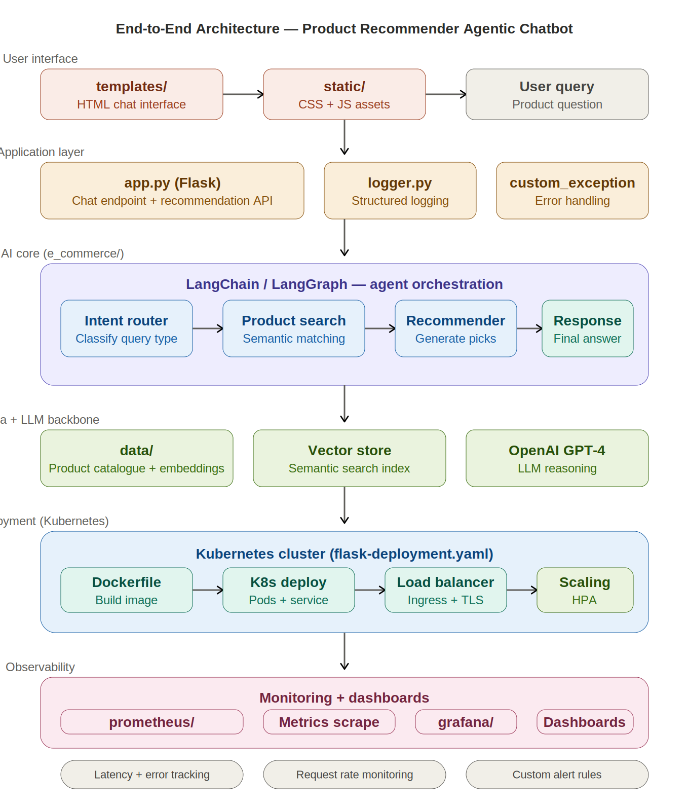

# 🛒 Product Recommender — Agentic AI Chatbot with Kubernetes & Observability

[](https://python.org)
[](https://langchain.com)
[](https://flask.palletsprojects.com)
[](https://docker.com)
[](https://kubernetes.io)
[](https://prometheus.io)
[](https://grafana.com)
[](LICENSE)

An **agentic AI chatbot** that recommends products through natural language conversation. Built with LangChain for agent orchestration, Flask for the web interface, and deployed on **Kubernetes** with full **Prometheus + Grafana observability** — the complete production stack.

---

## 📑 Table of Contents

- [Why This Project](#-why-this-project)
- [Architecture](#-architecture)
- [How the Agents Work](#-how-the-agents-work)
- [Tech Stack](#-tech-stack)
- [Project Structure](#-project-structure)
- [Getting Started](#-getting-started)
- [Kubernetes Deployment](#-kubernetes-deployment)
- [Observability](#-observability)
- [Future Improvements](#-future-improvements)

---

## 🎯 Why This Project

Most recommendation system demos stop at a Jupyter notebook with collaborative filtering. This project takes a fundamentally different approach — it builds an **agentic chatbot** where users describe what they want in natural language, and AI agents handle intent classification, product search, and personalised recommendations. On top of that, it includes what most portfolio projects skip entirely: **Kubernetes deployment** with **Prometheus metrics and Grafana dashboards** for production-grade observability. It's the difference between a demo and a system you'd actually run.

---

## 🏗 Architecture



**Request Flow:** User asks a product question via the HTML chat UI → Flask `app.py` receives the query → LangChain agent pipeline classifies intent → searches the product catalogue semantically → generates personalised recommendations via LLM → returns a conversational response.

**Infrastructure:** The app is containerised with Docker, deployed to Kubernetes via `flask-deployment.yaml` with pods, services, load balancing, and horizontal pod autoscaling. Prometheus scrapes metrics from the application, and Grafana dashboards visualise latency, error rates, and request throughput in real time.

---

## 🧠 How the Agents Work

### Agentic Recommendation Pipeline

Unlike traditional recommender systems that rely on user-item matrices, this system uses **AI agents** that reason about user needs in natural language:

```
User: "I need a lightweight laptop for travel under €1000"
                    │
                    ▼
         ┌──────────────────┐
         │   Intent Router   │ → Classifies: product recommendation
         └────────┬─────────┘
                  │
                  ▼
         ┌──────────────────┐
         │  Product Search   │ → Queries catalogue: laptop + lightweight + <€1000
         └────────┬─────────┘
                  │
                  ▼
         ┌──────────────────┐
         │   Recommender     │ → Ranks matches, explains trade-offs
         └────────┬─────────┘
                  │
                  ▼
         ┌──────────────────┐
         │  Response Agent   │ → "Here are 3 great options for travel..."
         └──────────────────┘
```

### Agent Roles

| Agent | Role | How It Works |
|---|---|---|
| **Intent Router** | Classifies the user's query type | Determines if it's a product search, comparison, general question, or chitchat |
| **Product Search** | Finds relevant products from the catalogue | Semantic matching against product embeddings in the vector store |
| **Recommender** | Ranks and explains product picks | Uses LLM reasoning to weigh features against user preferences |
| **Response Composer** | Generates conversational output | Produces a natural, helpful answer with product details and reasoning |

### Why Agentic over Traditional Recommendations?

| | Traditional (Collaborative/Content) | Agentic AI |
|---|---|---|
| **Input** | User ID + interaction history | Free-form natural language |
| **Cold start** | Major problem | Works from first query |
| **Explainability** | "Users like you also bought..." | "This laptop is 1.2kg with 12hr battery, ideal for your travel use case" |
| **Multi-turn** | Single request/response | Conversational refinement |
| **Flexibility** | Fixed feature set | Understands any product attribute mentioned |

---

## 🛠 Tech Stack

### AI & Application

| Tool | Role |
|---|---|
| **Python 3.10+** | Core language |
| **LangChain** | Agent framework — prompt templates, chains, tool integration |
| **OpenAI GPT-4** | LLM backbone for reasoning and response generation |
| **Flask** | Web application (`app.py`) with chat endpoint |
| **HTML / CSS / JS** | Chat interface (`templates/` + `static/`) |

### Data

| Tool | Role |
|---|---|
| **data/** | Product catalogue dataset |
| **Vector store** | Semantic search index over product embeddings |

### Infrastructure & DevOps

| Tool | Role |
|---|---|
| **Docker** | Containerises the application (`Dockerfile`) |
| **Kubernetes** | Container orchestration — pods, services, scaling (`flask-deployment.yaml`) |
| **Prometheus** | Metrics collection — request latency, error rates, throughput (`prometheus/`) |
| **Grafana** | Monitoring dashboards — real-time visualisation of application health (`grafana/`) |

### Production Utilities

| Tool | Role |
|---|---|
| **logger.py** | Structured application logging |
| **custom_exception.py** | Centralised error handling with stack traces |
| **setup.py** | Package configuration |

---

## 📁 Project Structure

```
Product_Recommender_System_AgenticAI_Chatbot/
├── e_commerce/                  # Core agentic AI module
│   ├── __init__.py
│   ├── agents/                  # Agent definitions (router, search, recommender)
│   ├── tools/                   # Tool integrations (catalogue search, LLM calls)
│   └── config.py                # API keys, model config
├── data/                        # Product catalogue dataset
├── templates/                   # Flask HTML templates (chat UI)
├── static/                      # CSS + JS assets for frontend
├── grafana/                     # Grafana dashboard configurations
├── prometheus/                  # Prometheus scrape configs + alert rules
├── assets/                      # Architecture diagram
│   └── architecture.png
├── app.py                       # Flask entry point — chat + recommendation API
├── logger.py                    # Structured logging
├── custom_exception.py          # Centralised exception handling
├── flask-deployment.yaml        # Kubernetes deployment manifest
├── Dockerfile                   # Container build definition
├── requirements.txt             # Python dependencies
├── setup.py                     # Package setup
├── __init__.py                  # Package init
└── README.md
```

---

## 🚀 Getting Started

### Prerequisites

- Python 3.10+
- OpenAI API key
- Docker (for containerised deployment)
- Kubernetes cluster (for K8s deployment — minikube works locally)

### Local Development

```bash
# 1. Clone the repo
git clone https://github.com/nishantrv/Product_Recommender_System_AgenticAI_Chatbot.git
cd Product_Recommender_System_AgenticAI_Chatbot

# 2. Create virtual environment
python -m venv venv
source venv/bin/activate  # Windows: venv\Scripts\activate

# 3. Install dependencies
pip install -r requirements.txt

# 4. Set environment variables
export OPENAI_API_KEY="sk-..."

# 5. Run the Flask app
python app.py
# Chat UI available at http://localhost:5000
```

### Docker

```bash
docker build -t product-recommender-chatbot .
docker run -p 5000:5000 \
  -e OPENAI_API_KEY="sk-..." \
  product-recommender-chatbot
```

---

## ☸️ Kubernetes Deployment

The application includes a full Kubernetes deployment manifest (`flask-deployment.yaml`):

```bash
# Apply the deployment
kubectl apply -f flask-deployment.yaml

# Check pods are running
kubectl get pods

# Get the service endpoint
kubectl get svc
```

### What the Manifest Includes

| Resource | Purpose |
|---|---|
| **Deployment** | Manages Flask pod replicas with rolling updates |
| **Service** | Exposes the app internally (ClusterIP) or externally (LoadBalancer) |
| **Resource limits** | CPU/memory requests and limits per pod |
| **Health checks** | Liveness and readiness probes |

### Scaling

```bash
# Manual scaling
kubectl scale deployment flask-app --replicas=3

# Or use Horizontal Pod Autoscaler
kubectl autoscale deployment flask-app --min=2 --max=10 --cpu-percent=70
```

---

## 📊 Observability

This project includes **production-grade monitoring** that most portfolio projects completely skip.

### Prometheus (`prometheus/`)

Prometheus scrapes application metrics at regular intervals:

- **Request latency** — P50, P95, P99 response times
- **Error rate** — 4xx and 5xx responses per endpoint
- **Request throughput** — Requests per second
- **Agent performance** — Per-agent execution time

```bash
# Deploy Prometheus (if using K8s)
kubectl apply -f prometheus/
```

### Grafana (`grafana/`)

Grafana dashboards visualise the Prometheus metrics:

- **Application health** — Overall request rate, error percentage, latency distributions
- **Agent performance** — Which agents are slowest, which fail most often
- **Resource usage** — CPU, memory per pod

```bash
# Deploy Grafana (if using K8s)
kubectl apply -f grafana/

# Access dashboard at http://localhost:3000 (default: admin/admin)
```

### Why This Matters

Observability is what separates a demo from a production system. When a recruiter or interviewer sees Prometheus + Grafana in your stack, it signals that you think about reliability, debugging, and operations — not just model accuracy.


## 🤝 Contributing

Contributions and feedback are welcome! Feel free to open an issue or submit a pull request.

---

## 📄 License

This project is licensed under the MIT License — see the [LICENSE](LICENSE) file for details.

---

**Built by [Nishant Ranjan Verma](https://github.com/nishantrv)** | Dublin, Ireland